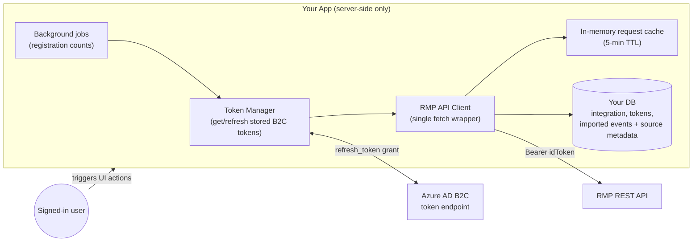

# RMP (CloudLabs CE Request Portal) Integration — Implementation Guide

> **Purpose**: This document is a complete, self-contained specification for implementing an
> integration with the CloudLabs "CE Request Portal" (RMP) — the same integration that exists in
> the CloudLabs Experts App — in a different application. It is written for an AI coding agent
> (GitHub Copilot) or a developer to implement from scratch. All API contracts below were
> verified against the live RMP API (prod: `api.cloudevents.ai`, QA: `events-qa-api.cloudlabs.ai`).
>
> **Adapt to your stack**: examples use TypeScript + SQL, but nothing depends on a specific
> framework. Wherever this doc says `<your equivalent>`, substitute your project's pattern.

---

## 1. What this integration does

RMP is an external event-request management portal (Angular SPA at `admin.cloudevents.ai`,
attendee portal at `ms-workshops.cloudevents.ai`, REST API at `api.cloudevents.ai`). Customers
submit **event requests** there. Your app integrates so that internal users can:

1. **Browse** RMP requests inside your app (list + rich detail), without opening RMP.
2. **Import** a request as a first-class local record (an "event") with a one-time snapshot of
   its source metadata.
3. **Detect drift**: periodically compare the local record against RMP (title/schedule changed
   upstream?) and let an admin accept the changes.
4. **Pull live registration counts** for imported events (background job + manual refresh).
5. Optionally **sync a track catalogue** (RMP "tracks" → your local "templates").

### Core design decision (important)

**This is a live-API integration with USER-DELEGATED authentication.** There is **no service
account** — RMP does not offer client-credentials auth. Every API call is made server-side *on
behalf of a signed-in user*, using the **Azure AD B2C JWT** issued when that user logged into
your app. Consequences you must design around:

- RMP results are **scoped to the calling user's RMP account** (a user who has no access in the
  RMP portal gets errors/empty results even though your app authenticated them fine).
- Background jobs must **borrow a stored user token** (see §7).
- Your app must **store OAuth tokens server-side** (access/id/refresh) per user.

---

## 2. Terminology & the three identifiers (memorize these)

| Term | Example | What it is |
|---|---|---|
| **Tenant ID** | `EAB203B6-FF38-4DFE-912F-D09EBD3E57E6` | RMP tenant GUID; path parameter on most admin APIs |
| **RequestUniqueName** | `2614AF1C-7505-4147-A82F-3AE5B5C0B0CC` | GUID of a request. Use for the *detail* endpoint. Store as `source_request_id` |
| **RequestId** (a.k.a. request code) | `MS960771FQYKAD` | Human-readable code shown in RMP UI. **The search API matches THIS, not the GUID.** Store as `source_request_code` |
| **EventUniqueName** | `5117D207-0BA5-461E-9CCA-CDE3189E218F` | GUID of the *attendee-portal event* linked to a request. **Nullable** (request may have no attendee event yet). Needed for the registrations dashboard API |
| **Track** | `PartnerEventTrackUniqueName` GUID | Catalogue entry (course/lab definition) a request is based on; use for template matching |

**Never conflate these.** The most common bugs in the original implementation came from mixing
them up (e.g., searching `myevents` by GUID — see gotcha G1).

---

## 3. Architecture overview



Rules:
- **All RMP calls happen server-side.** Never expose tokens to the browser.
- One shared API client class; one shared token manager; every feature goes through them.

---

## 4. Authentication (Azure AD B2C, user-delegated)

### 4.1 Prerequisites

- Your app's login must be (or include) **Azure AD B2C OIDC** against the same B2C tenant/policy
  that RMP trusts. RMP validates the **id_token JWT** issued by that tenant.
- Request scopes: `openid profile email offline_access` (offline_access ⇒ refresh_token).
- Store per user, server-side (e.g., an `account`/`oauth_token` table):
  `access_token`, `id_token`, `refresh_token`, `access_token_expires_at`, `updated_at`.

### 4.2 Which token to send

Send **`id_token`** as the Bearer token. With OIDC-only scopes, B2C's `access_token` is an
opaque string RMP cannot validate; the `id_token` is the JWT RMP accepts:

```
Authorization: Bearer <id_token>
```

Fallback to `access_token` only if `id_token` is absent.

### 4.3 Token acquisition function (implement exactly this contract)

```ts
// getRmpTokenForUser(userId): Promise<string>
// Throws TokenError with one of these codes:
//   NO_ACCOUNT        – user never signed in via B2C (no stored tokens)
//   NO_REFRESH_TOKEN  – token expired and there is nothing to refresh with
//   TOKEN_EXPIRED     – refresh endpoint returned 400/401 (refresh token dead)
//   REFRESH_FAILED    – network/other error calling the refresh endpoint
```

Algorithm:
1. Load the user's stored B2C token row. Missing → `NO_ACCOUNT`.
2. `token = idToken ?? accessToken`. Determine expiry: stored `access_token_expires_at`, else
   decode the JWT `exp` claim (base64url part 2, `exp` is seconds → ms).
3. If expiry is more than **5 minutes** away → return token as-is.
4. Otherwise refresh:
   ```
   POST https://{B2C_TENANT}.b2clogin.com/{B2C_TENANT}.onmicrosoft.com/{POLICY}/oauth2/v2.0/token
   Content-Type: application/x-www-form-urlencoded

   grant_type=refresh_token
   client_id={B2C_CLIENT_ID}
   refresh_token={stored refresh_token}
   scope=openid profile email offline_access
   ```
   Response: `{ access_token, id_token?, refresh_token?, expires_in }`.
5. Persist ALL returned tokens back to the store (B2C rotates refresh tokens — always save the
   new one; this is what keeps background jobs alive indefinitely).
6. No refresh_token stored → `NO_REFRESH_TOKEN`. HTTP 400/401 → `TOKEN_EXPIRED`. Other →
   `REFRESH_FAILED`.

### 4.4 Surfacing token errors to the UI

Map consistently in your API layer:
- `NO_ACCOUNT` → 403 + flag `requiresB2CAuth: true` ("Sign in with your CloudLabs account")
- `NO_REFRESH_TOKEN` / `TOKEN_EXPIRED` / `REFRESH_FAILED` → 401 + flag `requiresReauth: true`
  ("Please sign out and back in")

---

## 5. RMP API reference (verified contracts)

Base URL comes from the integration record (§6). Timeout: 30s default (use `AbortSignal.timeout`).
Headers on every call:

```
Content-Type: application/json
Accept-Language: en-US
Authorization: Bearer {token}
```

### 5.1 List / search requests

```
POST {base}/api/admin/v1.0/tenants/{tenantId}/myevents
```

Body (all optional except paging):

```json
{
  "PageNumber": 1,
  "PageSize": 25,
  "SearchRequest": "MS960771FQYKAD",
  "RequestorName": "", "SearchTitle": "", "SearchEventPM": "",
  "IsPrivate": null,
  "RequestStartDate": "", "RequestEndDate": "",
  "ScheduleStartDate": "", "ScheduleEndDate": "",
  "EventType": "", "Status": "3,6,8", "EventFormat": "",
  "TrackUniqueNames": "", "BudgetStatus": "", "FulfilmentStatus": ""
}
```

Response:

```json
{ "Status": "Success", "Data": [ {
    "RequestId": "MS960771FQYKAD",
    "RequestUniqueName": "2614AF1C-7505-4147-A82F-3AE5B5C0B0CC",
    "Title": "...", "Status": "ApprovedActionRequired",
    "EventType": "Online", "EventFormat": "Hands-On Lab",
    "ScheduledDate": "2026-08-18T00:00:00", "RequestDate": "2026-07-16T10:57:23.28",
    "RequestorName": "...", "RequestorEmail": "...",
    "CreatorName": "...", "CreatorEmail": "...",
    "EventUniqueName": "5117D207-... or null",
    "IsPrivate": true, "TotalRecords": 1,
    "AdminURL": "...", "RegistrationsPageURL": "...", "AttendanceReportURL": "...",
    "BudgetStatus": "Pending", "FulfilmentStatus": "Pending", "EventPM": " ",
    "TemplateName": "...", "TimeZoneLabel": "(UTC+05:30) ...", "TimeZoneAbbreviation": "IST"
} ] }
```

Notes:
- `TotalRecords` is repeated on every item — read it from item[0] for pagination.
- **`SearchRequest` matches the request CODE (`RequestId`), not the GUID** (gotcha G1).
- Status filter is a comma string of numeric codes (see §5.5).
- Results are **scoped to the calling user's RMP account**.

### 5.2 Request detail (rich)

```
GET {base}/api/tenants/{tenantId}/eventrequests/{RequestUniqueName}
```

⚠️ **Different path family — NO `/admin/v1.0` prefix** (gotcha G2).

Response `Data` essentials:

```json
{
  "UniqueName": "2614AF1C-...", "RequestId": "MS960771FQYKAD",
  "Title": "...", "Description": "...",
  "EventRequestStatus": "Approved",
  "EventType": "Online", "CreatedBy": "...", "RequestorEmail": "...",
  "StartDate": "2026-08-18T00:00:00", "EndDate": "2026-08-20T00:00:00",
  "TimeZone": "India Standard Time", "TimeZoneId": 59,
  "DeliveryLanguageName": "English", "IsPrivate": true,
  "AdminBitlyURL": "...", "RegistrationBitlyURL": "...",
  "AdditionalEventSettings": "[{\"PartnerEventTrackUniqueName\":\"...\",\"PartnerEventTrackId\":123,\"AssociatedTrack\":{\"TrackTitle\":\"...\"},\"UserRegistrationLimit\":100}]",
  "SessionRequests": [ {
      "Id": 1, "UniqueName": "...", "Title": "...",
      "StartDate": "2026-08-18T00:00:00", "StartTime": "09:00:00", "EndTime": "11:00:00",
      "HasLab": true,
      "PartnerEventTrackUniqueName": "...", "PartnerEventTrackId": 123,
      "AdditionalSessionSettings": "[{\"DoYouNeedInstructor\":true,\"RequiredInsrtuctorCount\":2,\"NoOfInstructorFromEventAdmin\":2,\"NoOfInstructorFromSelfManaged\":null,\"InstructorRequirementType\":\"...\"}]"
  } ]
}
```

Parsing rules (all verified):
- **Times are already in the event's local timezone** (`TimeZone` is a *Windows* timezone name;
  map to IANA for date math). NEVER `new Date("2026-08-18")` a date-only string to derive the
  schedule — combine session `date + StartTime/EndTime` in the mapped IANA zone (gotcha G3).
- `StartDate`/`EndDate` on the root are **date-only** semantics (`.split("T")[0]`); real times
  live in `SessionRequests`.
- `AdditionalEventSettings` / `AdditionalSessionSettings` are **JSON strings** — parse
  defensively (try/catch; may be array or single object).
- RMP API typo: `RequiredInsrtuctorCount` (missing "u"). Read both spellings (gotcha G4).
- Instructor aggregates: `instructorRequiredFromAdmin` = any session with
  `NoOfInstructorFromEventAdmin > 0 && NoOfInstructorFromSelfManaged === null`;
  `totalInstructorsRequired` = **max** across sessions (one instructor covers multiple
  sessions), not the sum.
- This endpoint does **NOT** contain registration counts.

### 5.3 Registration counts (attendee-portal dashboard)

Two-step chain:
1. Resolve `EventUniqueName` from the `myevents` list (search by request **code**, fall back
   only if needed; match item by `RequestUniqueName === guid || RequestId === code`).
2. ```
   GET {base}/api/events/{EventUniqueName}/reports/dashboard
   ```
   ⚠️ **No tenant prefix in the path** (gotcha G2).

Response essentials:

```json
{ "Status": "Success", "Data": { "UsersStatusCount": {
    "TotalCount": 0, "Attended": 0,
    "PendingCount": null, "ApprovedCount": null, "DeniedCount": null
} } }
```

- `Approved/Pending/DeniedCount` are **null when the event has zero registrations** — normalize
  to 0 when the event resolved but counts are null.
- If the request has **no** `EventUniqueName`, report "count unavailable" (do not error).

### 5.4 Track catalogue (optional feature)

```
GET {base}/api/admin/v1.0/tenants/{tenantId}/trackList?$filter={text}&$pagenumber={n}&$pagesize={n}
```

- **Build the query string manually.** `URLSearchParams` encodes `$` as `%24` and RMP then
  ignores the pagination params entirely (gotcha G5).
- The server may clamp page size (~10). Strategy: probe page 1, read `TotalRows` from an item,
  compute pages from the *actual* returned page size, fetch all pages, **dedupe by
  `TrackUniqueName`**, stop early if a page returns only duplicates.

### 5.5 Status code mapping

RMP returns status *names*; normalize to numbers for filtering/UI:

```
Draft=1, Submitted=2, Approved=3, ApprovedActionRequired=3, Rejected=4,
Cancelled=5, "In Progress"/InProgress=6, Pending=7, Completed=8
```

### 5.6 Error handling contract (wrap in one place)

Implement a single `request<T>(method, path, body?)` wrapper that:
- Throws `IntegrationApiError { statusCode, message, details? }` for non-2xx (capture the raw
  body text as `details`).
- Maps `TimeoutError` → statusCode 408; network failure → statusCode 0.
- **Special case**: `myevents` returns **HTTP 500** with body
  `{"Status":"Error","ErrorDetail":"No event found."}` when a search matches nothing OR when
  the calling account has no visibility. Treat that specific 500 as an **empty result**, not an
  error (check `details.includes("No event found")`) (gotcha G6).
- Logs request (method, url, body, token prefix only — never the full token) and response.

---

## 6. Data model (adapt names to your conventions)

### 6.1 `integration` — connection config, one per RMP portal per tenant/org

```sql
CREATE TABLE integration (
  id               uuid PRIMARY KEY DEFAULT gen_random_uuid(),
  organization_id  uuid NOT NULL REFERENCES organization(id) ON DELETE CASCADE,
  name             text NOT NULL,                  -- display name, unique per org
  type             text NOT NULL,                  -- 'ce_request_portal'
  api_base_url     text NOT NULL,                  -- https://api.cloudevents.ai
  tenant_id        text,                           -- RMP tenant GUID
  client_id        text,                           -- reserved (no server auth today)
  encrypted_client_secret text,                    -- ENCRYPT AT REST (see §10)
  config           jsonb,                          -- { defaultPageSize, timeoutMs, retryAttempts,
                                                   --   defaultStatusFilter, defaultTimeZone,
                                                   --   customHeaders }
  status           text NOT NULL DEFAULT 'pending_setup',  -- pending_setup|active|error|inactive
  is_enabled       boolean NOT NULL DEFAULT true,
  is_archived      boolean NOT NULL DEFAULT false,
  last_health_check_at     timestamptz,
  last_health_check_status text,                   -- 'ok' | error message
  last_successful_sync_at  timestamptz,
  created_by uuid, updated_by uuid,
  created_at timestamptz NOT NULL DEFAULT now(),
  updated_at timestamptz NOT NULL DEFAULT now(),
  UNIQUE (organization_id, name)
);
```

### 6.2 `event_source_metadata` — immutable import snapshot, one per imported record

```sql
CREATE TABLE event_source_metadata (
  id                    uuid PRIMARY KEY DEFAULT gen_random_uuid(),
  event_id              uuid NOT NULL UNIQUE REFERENCES event(id) ON DELETE CASCADE,
  source_type           text NOT NULL,             -- 'ce_request_portal'
  source_integration_id uuid REFERENCES integration(id),
  source_request_id     text NOT NULL,             -- RequestUniqueName GUID
  source_request_code   text,                      -- RequestId human code "MS…"
  requestor_name text, requestor_email text,
  event_format text,
  track_unique_name text, track_id integer, track_title text,
  time_zone text, time_zone_id integer,            -- Windows TZ name + numeric id
  language text, admin_url text,
  created_at timestamptz NOT NULL DEFAULT now()
);
```

### 6.3 Columns on your local `event` (imported record)

```sql
ALTER TABLE event ADD COLUMN event_source            text;        -- 'ce_request_portal:{integrationId}' or null for local
ALTER TABLE event ADD COLUMN event_source_request_id text;        -- human code, shown in UI
ALTER TABLE event ADD COLUMN sync_status             text;        -- synced|out_of_sync|unknown|null
ALTER TABLE event ADD COLUMN sync_changes            jsonb;       -- diff payload (see §8.2)
ALTER TABLE event ADD COLUMN last_sync_check         timestamptz;
ALTER TABLE event ADD COLUMN approved_registration_count integer; -- null = never synced
ALTER TABLE event ADD COLUMN registration_count_synced_at timestamptz;
```

### 6.4 OAuth token storage

If your auth library (Better Auth / NextAuth / custom) already persists provider tokens per
user, reuse it. Required fields: `user_id, provider, access_token, id_token, refresh_token,
access_token_expires_at, updated_at`.

---

## 7. Background job token strategy ("token borrowing")

Background jobs have no session. Resolve a usable token per integration:

```ts
async function resolveTokenForIntegration(integration): Promise<string | null> {
  const candidates = dedupe([
    integration.createdBy,                       // most likely to have RMP access
    ...adminsOfOrganization(integration.organizationId),  // owners/admins
  ]);
  for (const userId of candidates) {
    try { return await getRmpTokenForUser(userId); }
    catch (e) { if (e instanceof TokenError) continue; throw e; }
  }
  return null; // skip integration this run; log a warning
}
```

Key facts:
- Each refresh **rotates** the refresh token; a job running 2× daily keeps the chain alive
  indefinitely without any human logging in. It only dies on B2C absolute-lifetime/revocation —
  self-heals the next time any admin signs in.
- **Known limitation to improve on**: a token can be *valid in B2C* but *unauthorized in RMP*.
  The above loop only skips on TokenError. RECOMMENDED: after acquiring a token, probe it with
  one cheap `myevents` call (PageSize 1); on 401/403/"No event found", fall through to the next
  candidate.

---

## 8. Feature slices (implement in this order)

### Phase 1 — Foundation
1. **Token manager** (§4.3) + unit tests for expiry decode/refresh persistence.
2. **API client** (§5.6 wrapper + the 4 endpoint methods + PascalCase→camelCase transforms +
   STATUS_MAP). Constructor takes `(integrationRecord, token)`.
3. **Integration CRUD + testConnection**:
   - `testConnection`: get caller's token → `POST myevents {PageNumber:1,PageSize:1}` →
     success ⇒ `status='active', last_health_check_status='ok'`; failure ⇒ `status='error'` +
     message. Map TokenError to `requiresReauth`.
   - Admin-only mutations; tenant-scope every query by organization.

### Phase 2 — Browse requests
4. **List endpoint** (`requests.list`): validate integration (enabled, not archived, belongs to
   caller's org) → cache lookup → token → `getMyEvents` → on success update
   `last_successful_sync_at` → cache result.
   - **Cache**: in-memory, key = `integrationId + sorted(filters)`, TTL 5 min,
     `forceRefresh` bypass+clear, **never cache empty results**. Return `fromCache` + `cacheAge`
     so the UI can show a "cached Xs ago / Refresh" affordance.
5. **Detail endpoint** (`requests.byIdDetailed`): no cache; returns parsed sessions,
   track info, instructor requirements.
6. **Linked-events endpoint**: given request IDs, return which are already imported (join on
   `event_source_metadata.source_request_id`).

### Phase 3 — Import a request
7. **`createEventFromRequest(integrationId, requestId, overrides?)`**:
   1. Fetch detail (server-side; never trust client-passed data for the snapshot).
   2. Duplicate check on `(source_integration_id, source_request_id)` → 409 CONFLICT.
   3. Template match (if you have templates): by `trackUniqueName == template.catalogueId`
      first; fallback exact name; fallback case-insensitive contains.
   4. Schedule: single session → its start/end; multi-session → store the sessions array
      `[{date, startTime, endTime}]` and derive the overall window **in the event's IANA
      timezone** (map from the Windows name).
   5. Insert local event: `event_source = 'ce_request_portal:{integrationId}'`,
      `event_source_request_id = <code>`, title/description/timezone/deliveryMode from detail
      unless overridden.
   6. Insert `event_source_metadata` snapshot (§6.2).
   7. Audit-log the import.

### Phase 4 — Drift detection (content sync)
8. **`checkEventSyncStatus(eventId)`** (and a bulk `refreshAllEventSyncStatus`):
   - Skip non-RMP events. Fetch fresh detail with the caller's token.
   - Compare: title; schedule (derive both sides to UTC instants before comparing — never
     compare raw date strings); status.
   - Persist: `sync_status = out_of_sync|synced`, `sync_changes = { titleChanged?, oldTitle,
     newTitle, scheduleChanged?, oldStartDate, newStartDate, newSessions?, newTimeZone?, … }`,
     `last_sync_check = now`. API error ⇒ `sync_status='unknown'` (keep old values).
9. **`acceptEventSyncChanges(eventId)`** (admin-only): apply the stored `sync_changes` to the
   event, reset `sync_status='synced'`, `sync_changes=null`.
   - Keep the *detection* and *application* logic in one shared module so the two never drift.

### Phase 5 — Registration counts
10. **`getApprovedRegistrationCount(requestGuid, requestCode?)`** in the API client:
    - Search `myevents` by GUID; if no exact match (or the "No event found" 500), retry with
      the **code**; match items by `RequestUniqueName === guid || RequestId === code/guid`.
    - No match ⇒ throw 404 ("request not visible to this account").
    - Match without `EventUniqueName` ⇒ return `{ approvedCount: null }` (no attendee event yet).
    - Else call the dashboard; `approvedCount = counts.ApprovedCount ?? 0`.
11. **Manual refresh mutation** (uses the *clicking user's* token). Error mapping:
    404 → "not found in RMP for your account (no access?)"; 401/403 → "re-auth needed";
    else 500 with the upstream message.
12. **Cron endpoint** (e.g. `POST /api/cron/registration-count-sync`, guarded by a
    `CRON_SECRET` bearer): candidates = imported, non-archived, not-yet-ended events; group by
    integration; borrow token (§7); fetch in parallel batches of ~5; update
    `approved_registration_count` + `registration_count_synced_at`; update integration
    `last_successful_sync_at` when ≥1 success. Schedule externally (GitHub Actions cron /
    scheduler) — e.g. twice daily.

### Phase 6 (optional) — Track catalogue → templates
13. `getTrackList` with the probe-and-paginate strategy (§5.4); template `checkSyncStatus`
    compares local template vs track (name/level/description; `trackDeleted` when missing).

---

## 9. UI patterns that worked well

- **Requests page**: table of `myevents` results; "cached Xs ago" pill + Refresh; row action
  "Create event" disabled when already linked (from the linked-events endpoint).
- **Imported-event page banner**: "Imported from CloudLabs — [Synced|Out of sync|Unknown]" +
  request code + "Check Sync" button + diff dialog with "Accept changes".
- **Registration summary** inline in that banner: `Approved registrations: N · Synced 2h ago ·
  [Refresh]` (manual refresh gated to admin roles) + optional threshold alert
  ("recommend ceil(N/25) instructors").
- Surface `requiresReauth` errors as a toast telling the user to sign out/in — do not retry
  silently.

---

## 10. Security checklist

- Tokens only server-side; never in client bundles, logs (log a prefix at most), or URLs.
- **Encrypt `encrypted_client_secret` at rest** (the original app left it plaintext — a known
  TODO; use AES-256-GCM with a KMS/env key). Currently unused (no service auth) but don't ship
  the same TODO.
- Tenant-scope **every** query by organization id; validate integration ownership before use.
- Cron endpoints: constant-time compare of `Authorization: Bearer {CRON_SECRET}`.
- Escape all RMP-sourced strings before HTML interpolation (emails, banners) — they're
  third-party input.
- Rate-limit manual refresh mutations (each = 2 upstream calls).

## 11. Testing strategy

- **Unit**: JWT expiry decode; STATUS_MAP; session→window derivation across timezones/DST;
  `AdditionalSessionSettings` parsing (typo variant, array vs object, malformed JSON);
  "No event found" 500 → empty result; count normalization (null→0 when event exists).
- **Contract fixtures**: record real JSON responses (like the samples in §5) as fixtures; test
  the transforms against them.
- **Integration (mock server)**: token refresh persistence (rotated refresh token saved);
  candidate fallback in the cron; cache TTL/bypass/no-empty-cache.
- **Manual smoke** (needs a real RMP account): list, detail, import, check-sync, count refresh.

## 12. Gotchas (hard-won — encode these as tests/comments)

| # | Gotcha |
|---|---|
| G1 | `myevents.SearchRequest` matches the human **code**, not the GUID. Search by code; match results by either field. |
| G2 | Path inconsistencies: detail = `/api/tenants/...` (no `/admin/v1.0`); dashboard = `/api/events/...` (no tenant at all). |
| G3 | All times are event-local; `TimeZone` is a **Windows** TZ name → map to IANA. Root Start/EndDate are date-only; real times in `SessionRequests`. Never `new Date(dateOnly)`. |
| G4 | API typo `RequiredInsrtuctorCount` — read both spellings. Instructor total = **max** across sessions. |
| G5 | `trackList` query params use `$` literally — build the query string by hand (no `URLSearchParams`). Server clamps page size; probe + paginate + dedupe. |
| G6 | Empty search / no-visibility = HTTP **500 "No event found."** — treat as empty, not error. |
| G7 | `Approved/Pending/DeniedCount` are null at zero registrations → normalize to 0 when the event resolved. `EventUniqueName` may be null (no attendee event yet). |
| G8 | RMP visibility is per-account: a valid B2C token ≠ RMP access. Design errors + cron fallback for this. |
| G9 | `ApprovedActionRequired` status maps to the same code as `Approved` (3). |
| G10 | In-memory cache is per-server: multi-instance deployments serve ≤TTL-stale lists. Fine for 5 min; use Redis if you need coherence. |
| G11 | Always persist rotated refresh tokens, or background jobs die within days. |

## 13. Configuration inputs you'll need from the RMP team

| Item | Example |
|---|---|
| API base URL (per env) | prod `https://api.cloudevents.ai`, QA `https://events-qa-api.cloudlabs.ai` |
| Tenant GUID | `EAB203B6-FF38-4DFE-912F-D09EBD3E57E6` |
| B2C tenant + policy + client_id | `{tenant}.b2clogin.com`, `b2c_1a_signup_signin_...`, SPA/app client id |
| An RMP account with tenant admin visibility | for the integration creator / cron borrowing |
| Default status filter | e.g. `"3,6,8"` (Approved, InProgress, Completed) |

---

*Source: reverse-engineered and battle-tested implementation in the CloudLabs Experts App
(`lib/integrations/api-client.ts`, `token-manager.ts`, `request-cache.ts`,
`trpc/routers/organization/scheduler/scheduler-requests-router.ts`, `scheduler-event-router.ts`,
`app/api/cron/registration-count-sync/route.ts`). API contracts verified against live RMP
prod/QA, July–August 2026.*
